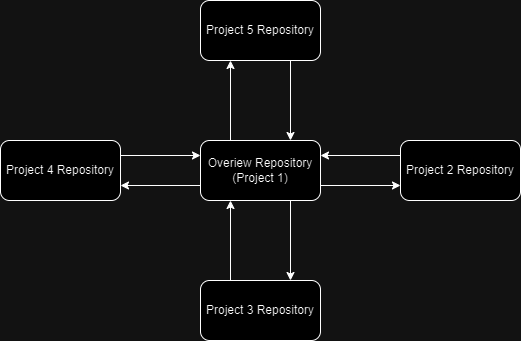
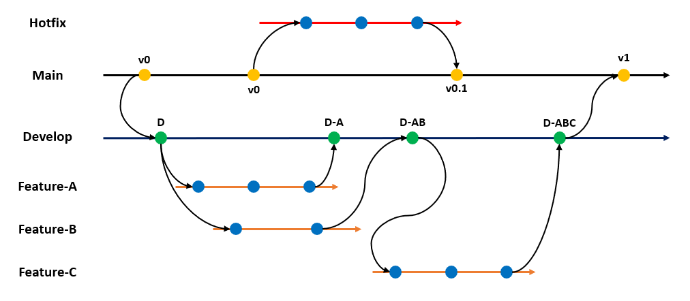

# 323 Overview 34229175

This an overview repository that will cover 4 other repositories in the form of projects throughout the semester.
Here's my planned and existing repositories:
-Overview Repository(Active)
-Project 2 Repository
-Project 3 Repository
-Project 4 Repository
-Project 5 Repository

Here's a diagram displaying the relationship between the repositories:

I will be using the same branching strategy accross all five projects, using a Main branch, a develop branch and then feature specific branches depending on what needs to be implemented. If the develop branch is complete and fully working I will push to the main and the main will almost act like a release branch. Here's a diagram of the described branching strategy:

Git version control systems use .gitignore files as configuration files to define which files and directories should be ignored and not tracked by the version control system. It is a text file with the exact name ".gitignore" and is normally stored in the project directory's root level. This file instructs Git which files or groups of files should not be added to the repository, regardless of whether they are present in the project directory. I will be using .gitignore in each repository to make sure unneccessary files aren't commited.

Due to security considerations, it is strongly advised against storing login passwords and other sensitive data in a Git repository, particularly on a public site like GitHub. The history of the changes you make to a Git repository is saved when you commit and push them, and if any sensitive information was added, it may be easily available to anyone with access to the repository. Here are some reasons why it's bad practise and ways to safely store credentials and sensitive information:

-Security risks: Storing private keys, API keys, tokens, or other sensitive data in a public repository makes it accessible to hackers. They could use this information to break into your accounts or computer systems.

-Version control: Git repositories keep track of all modifications, even any commits that included private data. Even if you delete the private information, it might still be accessible through other means in the repository's history.

-Automated scanning is a common practise used by GitHub and other sites to check repositories for exposed sensitive data. In the event that such data is found, the repository may be marked, and the owner may suffer account suspension or other repercussions.

To more securely manage sensitive information I will use some of the following techniques:

-Environment Variables: On your local computer or the server where the code will run, store confidential information in environment variables. Rather than explicitly hardcoding the sensitive data, access these variables in your code.

-Use configuration files that are not subject to version control (such as.env files). Your application can read these files while it is running and they may contain sensitive information.

-Gitignore: To indicate files and folders that Git should not monitor, create a.gitignore file. Include any files holding sensitive data, such as configuration files, in this list.

-Encryption: Take into account encrypting the data before committing it if you must save sensitive material in your repository (though doing so is typically not advised). But keeping track of encryption keys might be difficult.

-Use a version control system specifically created for managing secrets, such as HashiCorp's Vault or comparable solutions, if you need to manage sensitive information.

-Dedicated tools for managing secrets should be used, such as AWS Secrets Manager, Azure Key Vault, or HashiCorp Vault, which are all offered by cloud computing platforms. A centralised and safe method of managing sensitive data is offered by these technologies.

-Git Hooks: You can configure Git hooks to stop some files from being committed or pushed to the repository, such as those that contain sensitive data. This provides an extra degree of security.

Here is a Burndown Chart for the Semester:

References:

Das, T. (2022) Here’s a Git branching strategy for Better Team Collaboration, Medium. Available at: https://betterprogramming.pub/git-branching-strategy-for-better-team-collaboration-aacb5f235d05 (Accessed: 10 August 2023).

(No date) Git: Become an expert in Git &amp; GitHub in 4 Hours - Udemy. Available at: https://www.udemy.com/course/git-expert-4-hours/ (Accessed: 10 August 2023). 

(No date a) Free 60 minute scrum course - udemy. Available at: https://www.udemy.com/course/free-60-minute-scrum-course/ (Accessed: 10 August 2023). 